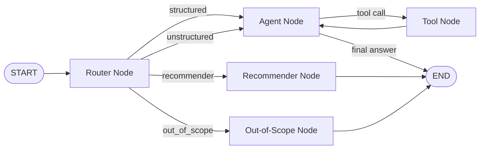

# Customer Service Data Analyst Agent - Implementation Plan

## 1. Goal and Deliverables
Build a LangGraph-based data analyst agent for the Bitext Customer Service dataset that satisfies all assignment requirements:
- Task 1: ReAct agent with query router, tools, multi-step reasoning, CLI reasoning trace, max-iteration fallback.
- Task 2: Persistent episodic memory + persistent user profile memory.
- Task 3: FastMCP server exposing at least 3 tools.
- Bonus A: Streamlit chat UI with reasoning visibility and session switching.
- Bonus B: Query recommender with suggest/refine/confirm flow.

Final deliverables in repository root:
- `agent.py`
- `tools.py`
- `data_loader.py`
- `memory.py`
- `recommender.py`
- `main.py`
- `mcp_server.py`
- `streamlit_app.py`
- `README.md`
- `langgraph.json` (fixed graph entry)
- dependency updates in `pyproject.toml`

---

## 2. Architecture and Logic

### Why this graph
- Router-first guarantees clean handling of out-of-scope requests and avoids accidental general-knowledge answers.
- ReAct loop (`agent <-> tools`) supports multi-step chains like `filter_by_intent -> count_rows`.
- Dedicated recommender branch avoids forcing recommendation behavior into the normal answer loop.
- Max-iteration protection ensures bounded execution and graceful fallback.

---

## 3. Model Strategy - Split Models by Role (Option B)

The agent uses a smaller, faster model for high-frequency, low-difficulty roles (routing, profile extraction, recommendation) and a stronger model for the main reasoning and tool-use loop. This is the cost-aware split the assignment explicitly rewards.

### Role-to-model mapping
- Main agent (reasoning + tool calls + final answer): strong model.
- Router (4-way classification): small model.
- Profile extraction (durable-fact JSON extraction): small model.
- Recommender (suggest/refine text): small model.

### Why this split is the right choice
- Cost: router and profile calls run on every turn but require only short, simple outputs; paying for a large model on these is wasteful. A small model handles them at a fraction of the cost.
- Latency: routing happens before any answer is produced, so a fast small model keeps perceived response time low.
- Quality where it matters: the main agent still uses the strong model, so multi-step tool reasoning and final-answer synthesis are not degraded.
- Right-sized difficulty: classification into 4 labels, extracting a few profile facts, and proposing one follow-up query are all well within a small model's capability, so accuracy stays high.

### Risks and mitigations
- Misrouting risk: a weaker router could mislabel a borderline query (for example, "examples of people wanting their money back" must be `structured`, not `out_of_scope`).
  - Mitigation: keep router prompt explicit with concrete in-scope vs out-of-scope examples; default to `structured` when the label is ambiguous so the query still reaches the tool loop rather than being declined.
- Profile extraction drift: a small model may over-extract.
  - Mitigation: use JSON-mode output, extract only from the latest user+assistant exchange, and merge conservatively.

### Implementation pattern (environment variables)
- `NEBIUS_MAIN_MODEL` for the main agent (strong model).
- `NEBIUS_ROUTER_MODEL` for the router (small model).
- `NEBIUS_PROFILE_MODEL` for profile extraction (small model).
- `NEBIUS_RECOMMENDER_MODEL` for the recommender (small model).
- Fallback rule: if a role-specific variable is missing, use `NEBIUS_MODEL`.

A single LLM factory helper resolves the correct model per role from these variables, so each node requests its model by role name rather than hardcoding an ID. This keeps roles independently tunable and makes the split easy to justify in the README.

---

## 4. Implementation Phases

## Phase 0 - Baseline and dependencies
1. Update `pyproject.toml` dependencies (pinned where practical):
   - `langgraph-checkpoint-sqlite`
   - `fastmcp`
   - `streamlit`
   - `langchain-community`
2. Configure environment variables in `.env.example` for the Option B split:
   - `NEBIUS_API_KEY`
   - `NEBIUS_BASE_URL`
   - `NEBIUS_MODEL` (fallback model used when a role-specific var is unset)
   - `NEBIUS_MAIN_MODEL` (strong model for the agent)
   - `NEBIUS_ROUTER_MODEL` (small model)
   - `NEBIUS_PROFILE_MODEL` (small model)
   - `NEBIUS_RECOMMENDER_MODEL` (small model)
3. Add a shared LLM factory helper that loads variables from `.env` via `load_dotenv()`, resolves model by role, applies base URL + API key, with `NEBIUS_MODEL` fallback. Place it where router, agent, memory, and recommender can all import it.

Logic:
- Dependency completion first prevents mid-implementation import failures.
- Env-based per-role model configuration enables the split without hardcoding IDs.
- `.env` loading avoids shell-specific export steps and keeps local setup reproducible.
- A single factory with a fallback rule guarantees the app runs even if only `NEBIUS_MODEL` is set, while allowing full per-role tuning when desired.

## Phase 1 - Data layer (`data_loader.py`)
1. Load dataset from HuggingFace: `bitext/Bitext-customer-support-llm-chatbot-training-dataset`.
2. Normalize columns:
   - `category`: uppercase
   - `intent`: lowercase
3. Cache as parquet in `data/bitext_cache.parquet`.
4. Add `@lru_cache(maxsize=1)` for in-process reuse.
5. Add helpers:
   - `get_categories()`
   - `get_intents(category=None)`

Logic:
- Disk cache speeds startup after first run.
- In-memory cache avoids repeated conversion costs.
- Normalization removes case ambiguity in tools/router behavior.

## Phase 2 - Tooling layer (`tools.py`)
Implement tools with clear descriptions + Pydantic schemas:
1. `list_categories()`
2. `list_intents(category)`
3. `count_rows()`
4. `filter_by_intent(intent)`
5. `filter_by_category(category)`
6. `show_examples(n=5, category=None, intent=None)`
7. `search_responses(keyword, n=5)`
8. `get_intent_distribution(category=None)`
9. `summarize_category(category, n_examples=3)`

Design details:
- Maintain module-level `_filtered_df` for chainable reasoning in a single query.
- Provide `_reset_filter()` and call at start of each user query.
- Return clear error messages with available category/intent hints.

Logic:
- Good descriptions improve tool selection quality as much as tool code.
- Shared filter state enables explicit multi-step workflows required by the assignment.

## Phase 3 - Graph and agent core (`agent.py`)
1. Define `AgentState`:
   - `messages`
   - `query_type`
   - `iteration_count`
   - `session_id`
   - `user_profile`
   - `pending_recommendation`
2. Build router node with 4 labels (uses `NEBIUS_ROUTER_MODEL` via the LLM factory):
   - `structured`, `unstructured`, `out_of_scope`, `recommender`
   - Prompt includes explicit in-scope vs out-of-scope examples; default to `structured` on ambiguity.
3. Build agent node (uses `NEBIUS_MAIN_MODEL` via the LLM factory):
   - Bind tools to LLM.
   - Inject concise system context (dataset coverage + profile).
   - Enforce `MAX_ITERATIONS` with graceful fallback.
4. Add out-of-scope node with canned refusal.
5. Add recommender node to produce suggestion text without tool loop.
6. Assemble graph and compile with optional checkpointer.
7. Add `run_query()` wrapper that streams events and records:
   - tool calls
   - observations
   - final answer

Logic:
- State carries everything needed for persistent and explainable behavior.
- Router separation improves control and assignment compliance.
- Stream parsing gives CLI/UI transparent reasoning output.

## Phase 4 - Memory (`memory.py`)
1. Episodic memory:
   - Use `SqliteSaver` with `memory/checkpoints.db`.
   - Use session ID as `thread_id`.
   - Add `list_sessions()` utility.
2. User profile memory:
   - Store profile in `memory/<session_id>_profile.json`.
   - Add `load_user_profile()`, `save_user_profile()`.
   - Add `update_user_profile()` extracting durable facts from latest user+assistant exchange (uses `NEBIUS_PROFILE_MODEL` via the LLM factory, JSON-mode output, conservative merge).
   - Add `format_profile_for_display()`.

Logic:
- Checkpointer handles full conversation state across restarts.
- Separate profile store avoids replaying full history and supports direct memory questions.

## Phase 5 - CLI (`main.py`)
1. Add args:
   - `--session`
   - `--query`
   - `--list-sessions`
   - `--verbose`
2. Interactive mode:
   - REPL loop.
   - Print tool calls and observations before final answer.
   - Commands: `exit`, `quit`, `profile`, `sessions`.
3. Single-query mode for testing.
4. Update profile after each turn.

Logic:
- CLI is the core grading interface.
- Human-readable reasoning trace demonstrates ReAct execution quality.

## Phase 6 - Bonus B recommender (`recommender.py` + graph/CLI integration)
1. Add suggestion generation from recent history + profile (uses `NEBIUS_RECOMMENDER_MODEL` via the LLM factory).
2. Add refinement function for user feedback (same recommender model).
3. Add confirmation/declination detection (rule-based, no model call).
4. Implement flow:
   - Suggest only.
   - Refine if user asks changes.
   - Execute only after explicit confirmation.

Logic:
- This exactly mirrors required bonus behavior and keeps execution user-controlled.

## Phase 7 - MCP server (`mcp_server.py`)
1. Create FastMCP app with instructions.
2. Expose at least these tools:
   - `list_categories`
   - `get_intent_distribution`
   - `show_examples`
3. Add extra useful tools:
   - `count_rows_for_intent` (stateless)
   - `summarize_category`
   - `search_responses`
4. Run on streamable-http (`host=0.0.0.0`, `port=8000`).

Logic:
- Stateless MCP tool variants are safer for concurrent clients.
- README must include client connection example for grading.

## Phase 8 - Bonus A Streamlit UI (`streamlit_app.py`)
1. Sidebar:
   - API key input.
   - Session ID selector/switch.
   - Profile panel.
2. Main chat:
   - user/assistant messages.
   - expandable reasoning trace per response.
3. Recommender integration:
   - suggestion and confirm/refine flow.

Logic:
- UI must preserve transparency, not only final answers.
- Session switching demonstrates memory persistence visually.

## Phase 9 - Docs and config
1. Fix `langgraph.json` graph path to compiled root graph.
2. Write `README.md` with:
   - setup in under 5 minutes
   - model choice and rationale
   - CLI run instructions
   - MCP startup and Python client usage
   - architecture overview and tool list
3. Ensure dependency versions are explicit.

Logic:
- README quality is directly graded; it must be runnable by a grader with minimal assumptions.

---

## 5. Acceptance Criteria Checklist

Task 1:
- [ ] Router classifies into structured/unstructured/out_of_scope before tool use.
- [ ] Out-of-scope always declined politely.
- [ ] Tools have clear descriptions + Pydantic schemas.
- [ ] Multi-step reasoning works (e.g., filter then count).
- [ ] CLI prints reasoning steps (tool calls + observations).
- [ ] Max iterations fallback works.

Task 2:
- [ ] Session restoration works across restarts with same `--session`.
- [ ] Follow-up queries use memory context correctly.
- [ ] User profile persists and answers "What do you remember about me?".

Task 3:
- [ ] FastMCP server runs and exposes >=3 tools.
- [ ] README includes client connection example and tool invocation.

Bonus A:
- [ ] Streamlit UI works with reasoning trace and session ID switch.

Bonus B:
- [ ] Suggest/refine/confirm query recommender works without auto-execution.

---

## 6. Verification and Iteration Loop

Run after each phase:
1. Syntax/import check for changed modules.
2. Focused smoke tests on new feature.
3. Regression check on core queries.
4. Fix issues immediately and rerun the same check.

Suggested test set:
- Structured:
  - "What categories exist in the dataset?"
  - "How many refund requests did we get?"
  - "Show me 5 examples of the SHIPPING category."
  - "What is the distribution of intents in the ACCOUNT category?"
- Unstructured:
  - "Summarize the FEEDBACK category."
  - "How do customer service representatives typically respond to cancellation requests?"
  - "Show me examples of people wanting their money back."
- Out-of-scope:
  - "Who won the 2024 Champions League?"
  - "What is the best CRM software for handling complaints?"
- Memory:
  - Turn 1: "Show me 3 examples from the REFUND category"
  - Turn 2: "Show me 3 more"
  - Turn 3: "What do you remember about me?"
- Recommender:
  - "What should I query next?" -> refine -> confirm -> execute.

Exit condition for implementation:
- All checklist items pass.
- README setup and commands work from clean environment.
- No unresolved runtime exceptions in tested paths.

---

## 7. Execution Order Summary
1. Dependencies and env config.
2. Data loader.
3. Tools.
4. Agent graph.
5. Memory.
6. CLI.
7. Recommender.
8. MCP server.
9. Streamlit UI.
10. README and final validation.

This order minimizes integration risk by building foundational layers first, then adding interfaces and bonus features on stable core behavior.
